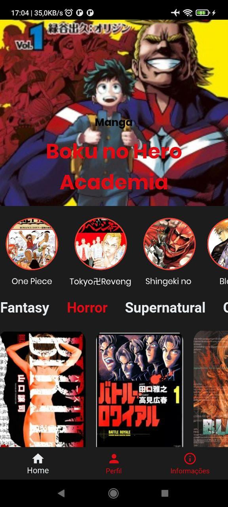
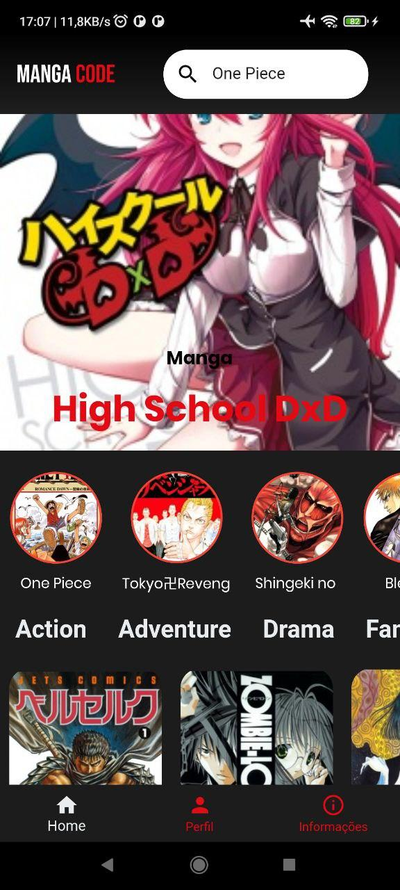
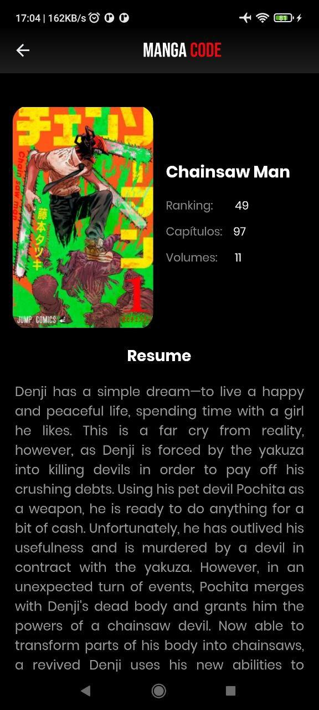
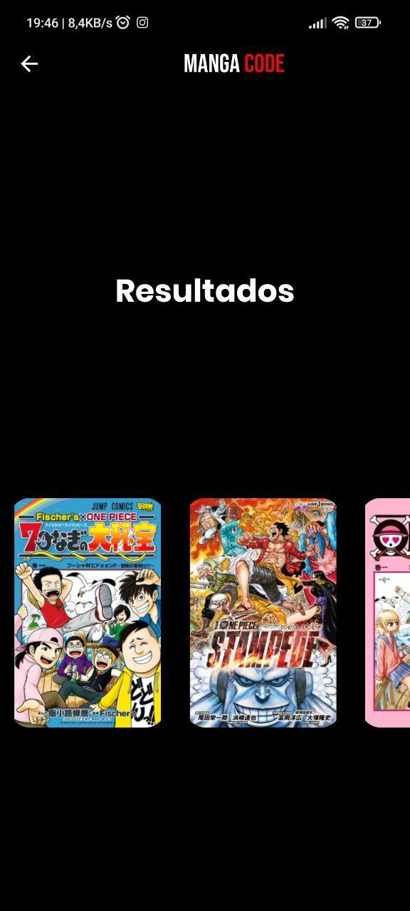
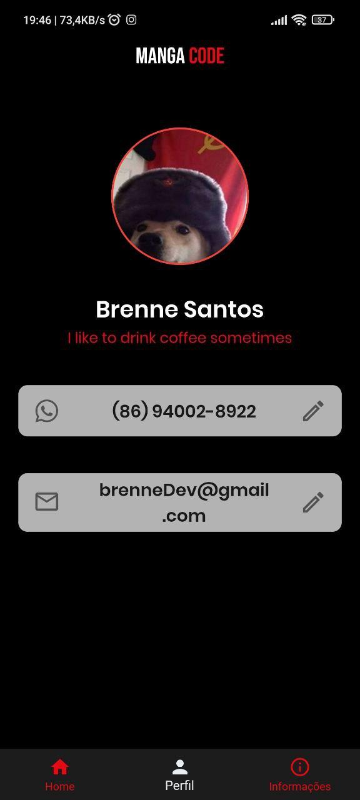
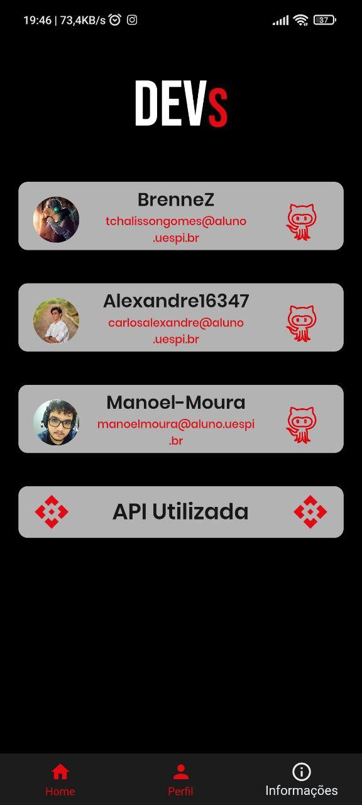

# 🚀 Code Manga

Projeto criado na matéria de Programação IV - Bloco V - Ciência da Computação - UESPI

# 📌 Projeto

- Code Manga

# 📝 Resumo

- Um app pensando em todos os otakus existentes no curso com a intencao de disponibilizar informações sobre mangas com mais facilidade para o usuário.
 
# 📒 Disciplina

- Programação IV

# 📎 Como executar o projeto
``` 
   # 1° git clone https://github.com/Manoel-Moura/Code-Manga
   # 2° cd code_manga
   # 3° conecte um device
   # 4° Dê run no app
   # 5° Divirta-se :) 
   ```
# ScreenShots
| Home Page                          | Home Page                                               |
| -------------------------------------- | ----------------------------------------------------------- |
|  |  |
| Detalhes                         | Busca                                               |
| -------------------------------------- | ----------------------------------------------------------- |
|  |  |
| Perfil                         | Sobre                                               |
| -------------------------------------- | ----------------------------------------------------------- |
|  |  |
# 🔥 Tecnologias utilizadas no projeto

- Dart
- Flutter

# 🚴 Autores
 - Tchalisson Brenne
 - Manoel Moura
 - Alezandre Nery
